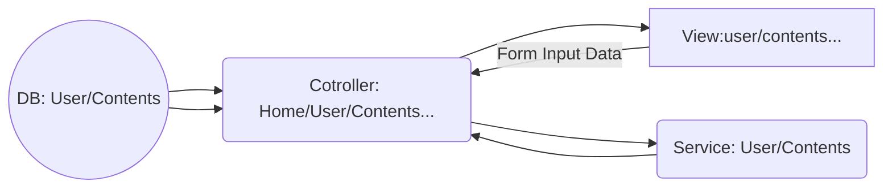

<p align="center">
<a href="https://travis-ci.org/laravel/framework"></a>
<a href="https://packagist.org/packages/laravel/framework"></a>
<a href="https://packagist.org/packages/laravel/framework"></a>
<a href="https://packagist.org/packages/laravel/framework"></a>
</p>

# Minto Project
みんなの投稿..略して**ミント**
ユーザーがイメージファイルとyoutube動画を投稿する。

## version

- PHP : 7
- Laravel : 5.8
- MySQL

## Running the app
```
php artisan serve
```
## Screen


## 機能

#### 【トップページ】​
- 投稿時刻の新しい順に画像 
-  動画を表示 ・全ユーザーのページへのリンクを表示 
- ログインフォームを表示（別ページにフォームを作成しても可） 
- 「ユーザー登録」をクリックで【ユーザー登録ページ】へ遷移 
- ユーザー名をクリックで【ユーザーページ】へ遷移 
- 画像タイトルをクリックで【画像ページ】へ遷移 
- 動画タイトルをクリックで【動画ページ】へ遷移 
- 動画はyoutubeの埋め込み動画

#### 【ユーザーページ】​
- 指定されたユーザーについて投稿時刻の新しい順に画像・動画を表示 
- 「画像投稿サイト」をクリックで【トップページ】へ遷移 
- 画像タイトルをクリックで【画像ページ】へ遷移 
- 動画タイトルをクリックで【動画ページ】へ遷移

#### 【画像ページ】
- 画像の詳細情報を表示
 
#### ​【動画ページ】​
- youtubeの埋め込み動画を表示 
- 動画の詳細情報を表示

#### 【ログイン中（各ページ共通）】
- 「画像をアップロード」ボタンをクリックで【画像アップロードページ】へ遷移 
- 「画像を投稿」ボタンをクリックで【画像投稿ページ】へ遷移 
- 「動画を投稿」ボタンをクリックで【動画投稿ページ】へ遷移 
- 「ログアウト」ボタンをクリックでログアウト状態へ遷移

#### 【画像アップロードページ】
- ログイン中のユーザーアカウントに紐付けて画像情報をデータベースに格納
- アップロードされたファイルはサーバ内に保存

#### 【画像投稿ページ】​
- ログイン中のユーザーアカウントに紐付けて画像情報をデータベースに格納
- 「画像URL」で指定されたファイルをweb上からダウンロードし、サーバ内に保存

#### 【動画投稿ページ】
- ログイン中のユーザーアカウントに紐付けて動画情報をデータベースに格納
- youtubeの動画はダウンロードしない。必要な情報をデータベースに格納し、このサイト上で埋め込み再生ができるようにする

#### 【ユーザー登録ページ】​
- ユーザーアカウントをデータベースに格納

## 特徴
#### ユーザー登録と認証
- ユーザー登録と認証はLaravelが提供してくれる事(middlewareなど)を利用
#### MVC
- ロジックを分離に気をつける(ServiceClass利用)
- newの代わりにIoCコンテナもしくはファサードを使う(結合性を低くする)
#### Storage
- ファイルをサーバー内に保存時、Storage使用
#### Validation
- 入力フォームをyoutube形式か検査
- ファイルがイメージ形式か検査
#### エラー処理
- URLのパラメタ検査でなるべく500帯のサーバ上エラーはないようにする。（ホームにリダイレクト）
- Routeに登録してないパスでrequestの時、laravelで提供する404ページに遷移


## Route:list

|Domain  |Method   |URI    |Name  |Action  |Middleware  |
|-----|------|------|------|------|------|
|        | GET|HEAD | /                                 | home             | App\Http\Controllers\HomeController@index                              | web          |
|        | GET|HEAD | api/user                          |                  | Closure                                                                | api,auth:api |
|        | GET|HEAD | contents/{id}                     | detail           | App\Http\Controllers\Contents\ContentsController@showDetail            | web          |
|        | POST     | contents/{id}/images/contribution |                  | App\Http\Controllers\Contents\ContentsController@imageUrlStore         | web,auth     |
|        | GET|HEAD | contents/{id}/images/contribution |                  | App\Http\Controllers\Contents\ContentsController@showImageContribution | web,auth     |
|        | POST     | contents/{id}/images/upload       |                  | App\Http\Controllers\Contents\ContentsController@imageFileStore        | web,auth     |
|        | GET|HEAD | contents/{id}/images/upload       |                  | App\Http\Controllers\Contents\ContentsController@showImageUpload       | web,auth     |
|        | GET|HEAD | contents/{id}/videos/contribution |                  | App\Http\Controllers\Contents\ContentsController@showVideoContribution | web,auth     |
|        | POST     | contents/{id}/videos/contribution |                  | App\Http\Controllers\Contents\ContentsController@videoUrlStore         | web,auth     |
|        | POST     | login                             | login            | App\Http\Controllers\Auth\LoginController@login                        | web,guest    |
|        | GET|HEAD | login                             | login            | App\Http\Controllers\Auth\LoginController@showLoginForm                | web,guest    |
|        | POST     | logout                            | logout           | App\Http\Controllers\Auth\LoginController@logout                       | web          |
|        | POST     | password/email                    | password.email   | App\Http\Controllers\Auth\ForgotPasswordController@sendResetLinkEmail  | web,guest    |
|        | GET|HEAD | password/reset                    | password.request | App\Http\Controllers\Auth\ForgotPasswordController@showLinkRequestForm | web,guest    |
|        | POST     | password/reset                    | password.update  | App\Http\Controllers\Auth\ResetPasswordController@reset                | web,guest    |
|        | GET|HEAD | password/reset/{token}            | password.reset   | App\Http\Controllers\Auth\ResetPasswordController@showResetForm        | web,guest    |
|        | POST     | register                          |                  | App\Http\Controllers\Auth\RegisterController@register                  | web,guest    |
|        | GET|HEAD | register                          | register         | App\Http\Controllers\Auth\RegisterController@index                     | web,guest    |
|        | GET|HEAD | users/{id}                        | user             | App\Http\Controllers\User\UserController@showUserList                  | web          |


## アーキテクチャーflow



## ER図
```mermaid
erDiagram  
 User  ||--o{  Contents  : contains  
 User  {  
 int id
 string name  
 string email
 date email_verified_at  
 string password
 string remember_token  
 date created_at
 date updated_at
 }  
 Contents 
 Contents  {  
 int id  
 int user_id
 string comment
 string contents_info
 date created_at
 date updated_at
 }  
 ```
 
 
## 改修余地
- フォームValidationロジックの分離(Form Request利用)
- 削除機能
- 検索機能
- 個別のエラーページ作成
- デート形のフォーマット変更
- デザイン
-  view側をblade以外FW使用
-  S3利用
-  WEB公開

## Ref
- https://laravel.com/docs/5.8
- youtube検索
- google検索
## License

The Laravel framework is open-source software licensed under the [MIT license](https://opensource.org/licenses/MIT).
